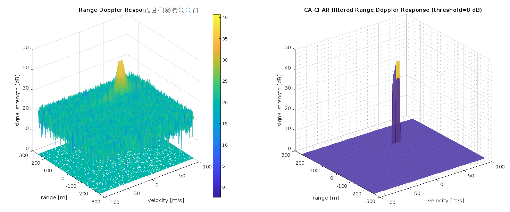

# SFND Radar Target Generation Detection (2D CA-CFAR)

This repository contains the implementation of the final project of lesson 3 (`Radar Sensor`) in `Sensor Fusion Nanodegree` in Udacity. All the code is implemented in Matlab Online and the rubrics are below.

The project employs the 2D [CA-CFAR](https://en.wikipedia.org/wiki/Constant_false_alarm_rate) (Cell-Averaging Constant False Alarm Rate) technique for the purpose of detecting target measurements against a background characterized by noise in the context of a frequency-modulated continuous-wave (FMCW) radar.

The accompanying illustration depicts a FMCW measurement of a target situated at a distance of 100 meters, exhibiting a velocity of 37 meters per second. The left plot illustrates the measurement in its noisy state as obtained from the frequency mixer, while the right plot presents the Radar response post-application of the CA-CFAR filtering process.

<p align="center">
  
</p>

## Project Rubrics

### FMCW Waveform Design

__1 - Using the given system requirements, design a FMCW waveform. Find its Bandwidth (B), chirp time (Tchirp) and slope of the chirp. the calculated slope should be around 2e13__

The considerations for waveform design in this context involve the analysis of Max Range and Range Resolution.

 - The determination of sweep bandwidth is contingent upon the range resolution, and the sweep slope is subsequently calculated by incorporating both the sweep bandwidth and sweep time. The mathematical expression for sweep bandwidth (B_sweep) is given by:

 ```matlab
 B_sweep = speed of light / (2 * rangeResolution)
 ```

 - The computation of sweep time is based on the duration required for the signal to traverse the unambiguously maximum range. In the case of an FMCW radar system, a general guideline stipulates that the sweep time should be at least 5 to 6 times the round trip time, with this example utilizing a factor of 5.5. The formula for sweep time (T_chirp) is expressed as:

 ```
 T_chirp = 5.5 * 2 * R_max / c
 ```

 - Subsequently, the slope of the chirp signal is derived as:

 ```
 Slope = Bandwidth / T_chirp
 ```

__Final values:__ Considering the provided specifications and adopting a sweep-to-roundtrip factor of 5.5, as commonly recommended for FMCW radar systems, the following parameter values have been ascertained:

- **Sweep bandwidth:** 150 MHz
- **Chirp time:** 7.33 μs (7.3333e-06 s)
- **Frequency drift / slope:** 20.45 THz/s (2.045e13 Hz/s)

As you can see, the slope obtained was around the expected value.

### Simulation Loop

__2 - Simulate Target movement and calculate the beat or mixed signal for every timestamp. A beat signal should be generated such that once range FFT implemented, it gives the correct range i.e the initial position of target assigned with an error margin of +/- 10 meters.__

Concerning the wave equations, the definition of FMCW transmit and received signals involves the utilization of these wave equations, where `α` represents the slope of the signal. The Transmit Signal is expressed as:

<p align="center">
  
</p>

The received signal is essentially a time-delayed version of the Transmit Signal. In the realm of digital signal processing, the time-delayed version is denoted as `(t−τ)`, with `τ` representing the delay time, equivalent to the signal's round-trip time in radar processing. Substituting `t` with `(t−τ)` yields the Receive Signal:

<p align="center">
  
</p>


Upon mixing these two signals, the resultant beat signal encapsulates values pertaining to both range and Doppler. Implementation of the 2D FFT on this beat signal facilitates the extraction of both Range and Doppler information.

The beat signal is calculated by multiplying the Transmit signal with the Receive signal, a process that functions as frequency subtraction. This operation is executed through element-wise multiplication of the transmit and receive signal matrices:

```matlab
Mixed or Beat Signal = Tx .* Rx
```

The outcome of the above operation is illustrated as:

<p align="center">
  
</p>

The code that represents the above part is given by:

```matlab
%% Signal Generation and Moving Target Simulation
% Running the radar scenario over time. 

for idx = 1:length(time)         
    
    % For each time step, update the Range of the Target
    % for constant velocity. 
    range_covered(idx) = initial_position + constant_velocity * time(idx);         
    time_delay(idx)  = 2 * range_covered(idx) / c;   
    
    % For each time step, update the transmitted and
    % received signal. 
    t_tx = time(idx);
    t_rx = time(idx) - time_delay(idx);
    
    tx_phase = 2 * pi * (fc * t_tx + 0.5 * slope * t_tx^2 );   
    rx_phase = 2 * pi * (fc * t_rx + 0.5 * slope * t_rx^2 );   
    
    transmitted_signal(idx) = cos(tx_phase);
    received_signal(idx) = cos(rx_phase);
    
    % Now, by mixing the Transmit and Receive signals, generate the beat signal.
    beat_signal(idx) = transmitted_signal(idx) .* received_signal(idx);
    
end
```

The results will be observed in the next step.

### Range FFT (1st FFT)

__3 - Implement the Range FFT on the Beat or Mixed Signal and plot the result. A correct implementation should generate a peak at the correct range, i.e the initial position of target assigned with an error margin of +/- 10 meters.__

The signal processing procedure involves several sequential steps for effective analysis. Initially, the application of the one-dimensional Fast Fourier Transform (1D FFT) on the Mixed Signal is imperative. Subsequently, it is essential to reshape the resultant vector into an array of dimensions `Nr*Nd`, where `Nr` represents the number of range bins and `Nd` is the number of Doppler bins.

Following the reshaping process, the FFT is executed on the beat signal, focusing specifically along the dimension corresponding to range bins (Nr). The output of the FFT undergoes normalization, and the absolute value of this normalized output is then computed. To streamline further analysis, only one half of the signal is retained.

The ensuing step involves the graphical representation of the processed signal through plotting. A notable outcome in the form of a peak at the initial position of the target is anticipated, thereby substantiating the efficacy of the signal processing methodology.

<p align="center">
  
</p>


The second Fast Fourier Transform (FFT) has been already incorporated into the code, resulting in the generation of a Range Doppler Map, as illustrated in the image below. The output of this process is denoted by the variable RDM. The subsequent task entails the implementation of Constant False Alarm Rate (CFAR) on this Range Doppler Map.

<p align="center">
  
</p>


__Final Answer:__ It is possible to observe that the peak was within the expected margin of error. The part of code implemented in this step is below.

```matlab
%% Range Measurement

% Reshape the vector into Nr*Nd array. Nr and Nd here would also define
% the size of Range and Doppler FFT, respectively.
beat_signal_reshaped = reshape(beat_signal, [num_range_cells, num_doppler_cells]);

% Run the FFT on the beat signal along the range bins dimension (Nr)
% and normalize.
range_fft = fft(beat_signal_reshaped, num_range_cells) ./ length(beat_signal_reshaped);

% Take the absolute value of FFT output
range_fft = abs(range_fft);

% Output of FFT is double-sided signal, but we are interested in only
% one side of the spectrum. Hence we throw out half of the samples.
range_fft = range_fft(1:(num_range_cells/2));

% Find the index of the maximum amplitude in the FFT output.
[max_amplitude, index] = max(range_fft);
estimated_distance_to_target = index

% Plotting the range
figure('Name', 'Range from First FFT')

% Plot FFT output 
plot(range_fft); 
axis([0, max_range, 0, 1]);
ylim([0, 0.5])
grid minor;
xlabel('measured range [m]');
ylabel('amplitude');
```

### 2D CFAR

__4 - Implement the 2D CFAR process on the output of 2D FFT operation, i.e the Range Doppler Map. The 2D CFAR processing should be able to suppress the noise and separate the target signal. The output should match the image shared in walkthrough.__

Subsequently, Cell Averaging Constant False Alarm Rate (CA-CFAR) was systematically implemented through an iterative process, involving a sweep across each range/doppler cell, designated as the cell-under-test (CUT). This entailed the computation of the integral within the vicinity of the CUT, encompassing the training cells. The scanning process was confined within the bounds of the CFAR signal storage array, and normalization was executed based on the count of valid cells examined. Notably, owing to the initialization of the CFAR signal array to zero, no explicit edge suppression was necessary. It is noteworthy that in the event of a signal being received in these edge areas, a marginal degradation in results may be anticipated, given the involvement of a reduced number of training cells.

Subsequent to the integral computation, the mean noise level of the sampled cells was determined, converting from power to dB scale, and then compared against a predetermined threshold. Cells falling below the threshold were subject to suppression, while those equal to or exceeding the threshold were retained. It is pertinent to highlight a deviation from the project description, as no additional normalization was performed at this stage; specifically, valid values were not arbitrarily set to one. Although utilizing the CFAR array as a multiplicative mask was deemed feasible with the project's approach, the resultant outcome would remain unchanged.

In relation the default values extracted from the lessons, the number of doppler training cells was increased to enhance the suppression of velocity errors. Simultaneously, the threshold was elevated to 8 dB, resulting in the revised configuration:

- **Distance training cells:** 8
- **Distance guard cells:** 4
- **Doppler training cells:** 8
- **Doppler training cells:** 8
- **Threshold:** 8 dB

The final outcome, illustrated at the commencement of this figures, demonstrated a sharper spike at 100 m and 37 m/s, although precision along the doppler/velocity axis could still be further optimized:

<p align="center">
  
</p>


It is possible to observe that the peak was within the expected margin of error. The part of code implemented in this step is below.

```matlab
%% CFAR implementation

% Slide Window through the complete Range Doppler Map

% Select the number of Training Cells in both dimensions.
Tr = 8;
Td = 8;

% Select the number of Guard Cells in both dimensions around the Cell
% under test (CUT) for accurate estimation
Gr = 4;
Gd = 8;

% Offset the threshold by SNR value in dB
offset = 8;

% Create a vector to store noise_level for each iteration on training cells
radius_doppler = Td + Gd;  % no. of doppler cells on either side of CUT
radius_range = Tr + Gr;  % no. of range cells on either side of CUT

Nrange_cells = num_range_cells/2 - 2 * radius_doppler; % no. of range dimension cells
Ndoppler_cells = num_doppler_cells - 2 * radius_range;   % no. of doppler dim. cells

grid_size = (2*Tr + 2*Gr + 1) * (2*Td + 2*Gd + 1);
Nguard_cut_cells = (2*Gr + 1) * (2*Gd + 1);     % no. guards + cell-under-test
Ntrain_cells = grid_size - Nguard_cut_cells;  % no. of training cells

noise_level = zeros(Nrange_cells, Ndoppler_cells);

% Design a loop such that it slides the CUT across the range-doppler map by
% giving margins at the edges for Training and Guard Cells.
%
% For every iteration, sum the signal level within all the training
% cells. To sum, convert the value from logarithmic to linear using db2pow
% function. Average the summed values for all the training
% cells used. After averaging, convert it back to logarithmic using pow2db.
%
% Further, add the offset to it to determine the threshold. Next, compare the
% signal under CUT with this threshold. If the CUT level > threshold, assign
% it a value of 1, else equate it to 0.

% Use RDM[x, y] as the matrix from the output of 2D FFT for 
% implementing CFAR.
cfar_signal = zeros(size(RDM));

r_min = radius_range + 1;
r_max = Nrange_cells - radius_range;

d_min = radius_doppler + 1;
d_max = Ndoppler_cells - radius_doppler;

for r = r_min : r_max
    for d = d_min : d_max
        cell_under_test = RDM(r, d);
        
        cell_count = 0;
        for delta_r = -radius_range : radius_range
            for delta_d = -radius_doppler : radius_doppler
                
                cr = r + delta_r;
                cd = d + delta_d;
                
                in_valid_range = (cr >= 1) && (cd >= 1) && (cr <= Nrange_cells) && (cd <= Ndoppler_cells);
                in_train_cell = abs(delta_r) > Gr || abs(delta_d) > Gd;
                
                if in_valid_range && in_train_cell
                    noise = db2pow(RDM(cr, cd));
                    noise_level(r, d) = noise_level(r, d) + noise;
                    cell_count = cell_count + 1;
                end
               
            end
        end

        % If the signal in the cell under test (CUT) exceeds the
        % threshold, we mark the cell as hot by setting it to 1.
        % We don't need to set it to zero, since the array
        % is already zeroed out.
        threshold = pow2db(noise_level(r, d) / cell_count) + offset;

        if (cell_under_test >= threshold)
            cfar_signal(r, d) = RDM(r, d); % ... or set to 1
        end
        
    end
end

% Display the CFAR output using the Surf function like we did for Range
% Doppler Response output.
figure('Name', 'CA-CFAR Filtered RDM');
ax1 = subplot(1, 2, 1);
surfc(doppler_axis, range_axis, RDM, 'LineStyle', 'none');
alpha 0.75;
zlim([0 50]);
xlabel('velocity [m/s]');
ylabel('range [m]');
zlabel('signal strength [dB]')
title('Range Doppler Response')
colorbar;

ax2 = subplot(1, 2, 2);
surf(doppler_axis, range_axis, cfar_signal, 'LineStyle', 'none');
alpha 0.75;
grid minor;
zlim([0, 50]);
xlabel('velocity [m/s]');
ylabel('range [m]');
zlabel('signal strength [dB]')
title(sprintf('CA-CFAR filtered Range Doppler Response (threshold=%d dB)', offset))
colorbar;

linkprop([ax1, ax2],{'CameraUpVector', 'CameraPosition', 'CameraTarget', 'XLim', 'YLim', 'ZLim'});
```

As a result, all project requirements were met and implemented successfully.